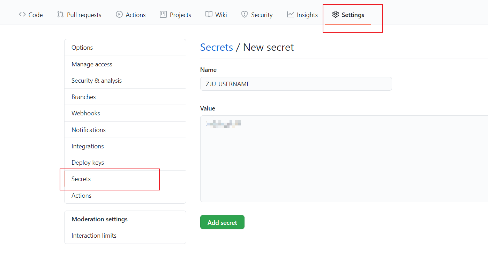

# @zju-health-report/action

浙江大学健康打卡自动打卡脚本，支持 Node.js 本地运行和 GitHub Action 定时运行。

> 原有的打卡脚本 https://github.com/Long0x0/ZJU-nCov-Hitcarder 迫于压力删库，因此以匿名身份创建此脚本供大家使用。

## 使用方法

1. 直接 Fork [zju-health-report-action-demo](https://github.com/zju-health-report/zju-health-report-action-demo)，或者新建 repo 并创建 `.github/workflows/action.yml` 和 `monthly.yml`。

    `action.yml` 内容:

    ```yml
    name: '@zju-health-report/action Demo'

    on:
      workflow_dispatch:
      schedule:
        # `0 23 * * *` 表示UTC 23:00，即北京时间7:00打卡（经测试，实际运行时间比设定时间晚几分钟到几十分钟）。
        - cron: '0 23 * * *'

    jobs:
      main:
        runs-on: ubuntu-latest
        strategy:
          fail-fast: false
          matrix:
            include:
              - username: ZJU_USERNAME
                password: ZJU_PASSWORD
        steps:
          - name: 打卡
            uses: zju-health-report/action@release
            with:
              username: ${{ secrets[matrix.username] }}
              password: ${{ secrets[matrix.password] }}

    ```

    `monthly.yml` 内容:

    ```yml
    name: 'Monthly Action'

    on:
      workflow_dispatch:
      schedule:
        - cron: '0 0 1 * *'

    jobs:
      main:
        runs-on: ubuntu-latest
        steps:
          - name: Checkout
            uses: actions/checkout@v2
          - name: Update
            run: |
              echo "one month" >> monthly.log
          - name: Commit files
            run: |
              git config --local user.name ${{ github.actor }}
              git status
              git add monthly.log
              git commit -m "Monthly update"
              git log
          - name: Push changes
            uses: ad-m/github-push-action@main
            with:
              github_token: ${{ secrets.GITHUB_TOKEN }}
              branch: ${{ github.ref }}
              force: true

    ```

2. 配置定时运行时间

   在 .github/workflows/action.yml 中更改时间：

   ```yml
   on:
   workflow_dispatch:
   schedule:
      - cron: '0 23 * * *'
   ```

3. 配置帐号

   Settings > Secrets > New repository secrets， 添加 `ZJU_USERNAME`，内容为浙大通行证账号（学号），添加`ZJU_PASSWORD`，内容为浙大通行证密码。

   

4. 配置多人打卡（可选）

   在 .github/workflows/action.yml 中添加一组，自行添加对应的Secrets。

   ```yml
      - username: ZJU_USERNAME
        password: ZJU_PASSWORD
      - username: ZJU_USERNAME2
        password: ZJU_PASSWORD2
   ```

5. 测试

   Actions > @zju-health-report/action Demo > Enable workflow > Run workflow。

   Actions > Monthly Action > Enable workflow > Run workflow。

6. 停用

   Actions > @zju-health-report/action Demo > Disable workflow。

   Actions > Monthly Action > Disable workflow。

## CLI

如果你安装了 Node.js，可以直接使用 `npx` 手动运行此打卡脚本。

Windows Powershell:

```bash
$env:username="浙大通行证用户名"
$env:password="浙大通行证密码"
npx github:zju-health-report/action#release
```

Windows CMD:

```bash
set username=浙大通行证用户名
set password=浙大通行证密码
npx github:zju-health-report/action#release
```

Unix:

```bash
username=浙大通行证用户名 password=浙大通行证密码 npx github:zju-health-report/action#release
```
